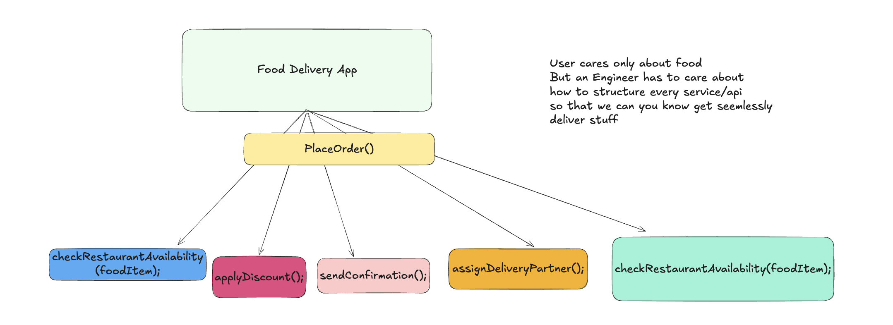

# OOPS

When I first started Learning OOPS , I always thought that it will be about just linked lists and trees and like all these 
examples which I am being taught in the tutoiral are only for one main purpose so that I can eventually understand every single
core concept around data structures.

But that is just 15% maybe  of what oops really, is in real life and in real world oops go beyond 
just trees linked list or explicitly declaring some class in a problem of priority queues 

It is a way to organize your code around real-world things. In a real 
project it may work with things like cars,vehicles, orders, products, notifications, 
carts, invoices, and many more.

Instead of keeping data in different variables and writing random functions everywhere, 
OOP allows you to keep related data and related actions together in one place which we often refer to as attributes and methods
of a class.

This makes your code easier to understand, easier to update, easier to test, 
and easier to maintain when your project becomes bigger. But to use OOP properly, 
you need to understand its core concepts. Because OOP is not only about creating objects.

It is about learning how to model real problems, manage complexity, reduce repeated code, 
and avoid turning your codebase into a messy system that breaks every time you change something.

I will be updating the file structure here properly but here in the first file we will go through building some of the very 
fundamental OOP core concepts which are required if you've master LLD. 

## 1. Classes: 

You can check out the implementation in the [Classes Code](classesss.cpp).

A simple very basic real life example is of a car in a code, we can create a car class with some basic attributes like color,speed,brand etc.
On top of that we can define some basic functions such as stop, accelerate, calculateSpeed etc as per what our useCases or business logic
we've to serve for.

But it is just a blueprint like when you go to buy a car you're been shown a catlog or you research about it online but all what
you see are images which are nothing but structures or images which cannot be experienced, yes obviously with the help of AI now you can 
do a lot of cool stuff! But in general you can't :) and hence you cannot live inside a blueprint and in order to experience you need to buy a car.

Similarly all the class in programming are simply blueprints and in order to use them for some real stuff like let's say placing 
an order for 2 butter naan and 1 plate butter chicken you"ll have to create an order instance(or object) for it in your codebase
You need to create some objects out of them so that you can actually look for it

### Access Modifiers: 
Access modifiers determine who can access members of a class:

public → Open to everyone; forms the class's external interface.

private → Hidden implementation details; accessible only within the class.

protected → Hidden from the outside world but available to derived classes, making it useful for inheritance.

| Modifier      | Same Class | Derived Class | Outside Class |
| ------------- | ---------- | ------------- | ------------- |
| **public**    | ✅          | ✅             | ✅           |
| **protected** | ✅          | ✅             | ❌           |
| **private**   | ✅          | ❌             | ❌           |

## 2. Objects

As explained above if your class is a blueprint then your object is nothing but just a real entity / instance
created from that blueprint. In simple words an object is a reusable copy of class For example, 
we created a Car class in the previous section. That Car class only defines what 
a car should have and what a car can do.

You can check out the implementation in the [Objects Code](objectss.cpp).

Here, car1, car2, and car3 are objects. All three objects are created from the same Car class. 
But each object has its own values.

Each object works independently.

If we increase the speed of car1, it will not change the speed of car2. 
If car2 starts, it does not mean car3 has also started.

They are separate objects created from the same class. 
This is one of the most important ideas in OOP. A class gives the structure. 
An object gives the real values.

Think about a house blueprint again. 
One blueprint can be used to build many houses. 
But after building them, each house can have a different color, different owner, 
different furniture, and different address. 
In the same way, one class can create many objects, and every object can have its own data.
Similar example can be taken for making a ticket booking system or a bank account opening system.

So, classes and objects together help us keep related data and behavior in one clean place. 
But in bigger applications, sometimes we do not only want to create objects. 
We also want to define a common set of actions that different classes must follow. 
That is where interfaces come in.

## 3. Interfaces

Now here comes a bit of twist a note before we start studying for interview purposes cpp doesn't have 
by default interfaces but but , Instead, interfaces are created using abstract classes with pure virtual functions. 
Because C++ natively supports multiple inheritance, a separate, dedicated "interface" type category is completely unnecessary

Now firstly understanding what interfaces are:

An interface is like a contract or a written agreement, It tells a class what methods it must have
,but **it does not explain how those methods should work**. In simple words, an interface says: “This class must provide these actions.”

Let's take a very simple example.

Imagine we are building a notification system. In an app, we may need to send notifications in different ways:

1. Email
2. SMS
3. WhatsApp
4. Push notification

All of them are different, but they have one common job:

They send a message. So instead of writing different logic everywhere, 
we can create one common interface called NotificationService.

### Pure Virtual Functions and Abstract Classes

A pure virtual function is a virtual function with no implementation in the base class, declared using = 0. 
A class with at least one pure virtual function is an abstract class that cannot be instantiated and serves 
as a blueprint for derived classes, which must provide their own implementation.

1. A class with at least one pure virtual function becomes an abstract class and Objects of abstract classes cannot be created directly.
2. Abstract classes are used to define interfaces and ensure common structure among derived classes.
3. Useful in polymorphism where different classes share the same interface but have different behaviors.
4. A pure virtual function forces derived classes to override it.
5. virtual void draw() = 0; declares a pure virtual function, forcing derived classes to provide their own implementation.

You can check out the implementation in the [Interfaces Code](interfacess.cpp).

### Design of Notification Service: 

# 💠 The 4 Pillars That Make OOP Powerful
## 1. Encapsulation
Encapsulation is one of the most important pillars of OOP. 
In simple words, encapsulation means keeping data and methods together inside a class, 
and not allowing other parts of the program to directly change the internal data.

Taking an example of Bank Holder Account to Implement it [Encapsulation Code](encaps.cpp)

BankAccount account = new BankAccount("Shivam", 5000);
account.deposit(2000);
account.withdraw(1000);
System.out.println(account.getBalance());

Now the class controls how the balance changes. If someone tries to deposit a negative amount, the
class can reject it. If someone tries to withdraw more money than available, 
the class can stop it. That is the main idea of encapsulation. 
We hide the internal data and expose only safe methods to work with that data.

This makes our code more secure, more controlled, and easier to maintain. 
If tomorrow we want to add more rules, like minimum balance, transaction charges, or daily withdrawal limits, 
we can add them inside the BankAccount class.The outside code does not need to know all these internal details. 
It only uses simple methods like deposit(), withdraw(), and getBalance().

So remember this simple line:

Encapsulation protects the data by controlling how it is accessed and changed. 
It hides the internal details of a class. But sometimes we do not only want to hide data. 
We also want to hide unnecessary complexity from the user. That idea is called abstraction, and we will understand it next.

## 2. Abstraction: 
Abstraction is another important pillar of OOP. In simple words, abstraction means hiding unnecessary details and 
showing only what is important. It helps us use something without knowing all the complex work happening behind the scenes.

As a user, you do not need to understand all this internal logic. 
You only see a simple interface. That is abstraction. 
It hides the complicated process and gives you a simple way to use it. 
In programming, abstraction works in the same way. We create simple methods for the outside world, 
and we hide the complex logic inside the class.

Let's understand this with a simple FoodOrder example. Imagine we are building a food delivery app. 
The user only wants to place an order. They do not care about every internal step like checking restaurant 
availability, calculating delivery charges, applying discount, assigning delivery partner, 
and sending confirmation. So we can create a simple method called placeOrder().

Check out code implementation here to implement it [Abstraction Code](abstractionss.cpp)

The user of this class only calls one simple method: placeOrder()
They do not need to call all the small internal methods one by one. They do not need to know how the restaurant is checked.
They do not need to know how delivery charge is calculated.They do not need to know how the delivery partner is assigned.

All those details are hidden inside the class. This is abstraction.
 We expose only the important action and hide the complex steps behind it. 
 This makes the code easier to use. It also makes the code easier to change. 
 For example, tomorrow if we want to change how delivery partners are assigned, 
 we can update the internal assignDeliveryPartner() method.

The outside code will still call the same placeOrder() method. Nothing changes for the user of the class. 
That is the beauty of abstraction. It gives a simple outside view and hides the complex inside work.

So remember this simple line:

Abstraction hides complexity and shows only what is necessary. 
### Encapsulation protects the internal data. Abstraction hides the internal process. 
Both are related, but they solve different problems. Now, what if multiple classes share the same data and behavior? That is where inheritance comes in.

## 3. Inheritance:

Inheritance is another important concept in OOP. In simple words, inheritance means one class can take properties and methods from another class. 
The class that gives the common code is called the parent class. The class that receives that code is called the child class. 
This helps us avoid writing the same code again and again.

Let’s understand this with a simple real-world example.

Think about different types of employees in a company. A company can have:

full-time employees
part-time employees
interns
All of them are employees.

So they may have some common details:

1. name
2. employee ID
3. department

And they may have some common actions:
show employee details
calculate salary
Instead of writing these common things again in every class, we can create one parent class called Employee. 
Then other classes can inherit from it.

But inheritance should be used carefully. Use inheritance only when there is a clear “is-a” relationship. For example:

A full-time employee is an employee.An intern is an employee.

A car is a vehicle.

A dog is an animal.

These are natural relationships. 
But do not use inheritance only because you want to reuse some code. 
If the relationship does not feel natural, inheritance can make the code confusing. 
In that case, composition is usually a better option.

So remember this simple line:

Inheritance allows one class to reuse and extend the behavior of another class. 
It helps us reduce repeated code when classes share a real parent-child relationship. 
But what happens when different child classes have the same method name, but each one behaves differently? 
That idea is called polymorphism, and we will understand it next.

## 4. Polymorphism: 

Polymorphism is one of those words that sounds difficult at first. But the idea is actually really really simple. 
Polymorphism means many forms. In OOP, it means the same action can behave differently depending on the object that is using it

Think about a payment system. In an app, users may pay using different methods:
1. Credit Card
2. UPI
3. PayPal

All payment methods have one common action i.e pay().
But each payment method performs that action in its own way. 
Credit card payment uses card details. UPI payment uses a UPI ID. 
PayPal payment uses a PayPal account. The method name is the same, 
but the behavior is different. That is polymorphism.

There are mainly two types of Polymorphism: 
1. Compile Time Polymorphism:
This happens when we use the same method name with different parameters. This is also called method overloading.

void sum(int a, int b) return a+b or void sum(int a ,int b, int c) return a+b+c;
2. Run Time Polymorphism: 
This is called Function overriding or method overriding.
Runtime polymorphism is more commonly used in real projects. 
Let’s understand it with a simple example.

Check out the code here at [Inheritance code](inheritance.cpp)

# 💠 Object Relationships: How Classes Work Together

## 🔹Association

Now let’s understand how objects are connected with each other. 
The first relationship is called association. In very simple and fundamental terms assosciation means one object knows about another object
.Both objects are connected, but they can still exist independently. One object does not fully own the other object. It's a has-a or what 
you say as uses-a kind of relationship. Both classes can exist independently.

Association is a relationship where one class uses or knows about another class.
The key idea is that the two objects are independent. They can exist without each other.
Let’s take a simple real-world example.

Think about a teacher and a student. A teacher can teach many students. A student can learn from many teachers. 
But both can exist separately. If one student leaves the class, the teacher still exists. If one teacher leaves the school, 
the student can still learn from another teacher. So the relationship is there, but ownership is not strong.

A student can exist without a particular teacher.
A teacher can exist without a particular student.

But they can still have a relationship:

Student  -------- studies under --------> Teacher

Neither owns the other.This is Association.

In my code implementation [Assosciation](association.cpp)

Here, Teacher and Student are two separate objects. The teacher object knows about the student objects. 
But the students are not completely owned by the teacher. They are created separately. That means they 
can exist even outside the Teacher class. This is the main point of association. Objects are connected, 
but they are still independent.

You can think of association like this

A teacher teaches students.
A doctor treats patients.
A driver drives a car.
A customer places an order.
In all these examples, objects are related, but one object does not fully control the life of the other object.

### Types of Association:
1. One-to-One relation
2. One-to-many relation
3. Many-to-one relation
4. Many-to-many relation

There is more depth to it which we will cover later just google search types of assosciation in oops and read articles from gfg and scaler 
then whenever you come back and have time.

Unidirectional Association: One class knows about another, but not vice versa. Example: A Student has a LibraryCard, but the LibraryCard doesn't know about the Student.
Bidirectional Association: Both classes know about and interact with each other. Example: A Teacher is assigned to a Classroom, and the Classroom knows its Teacher.

So remember this simple line:

Association means one object is connected to another object, but both can live independently. 
Association is the most general relationship between objects. But sometimes, one object is not just connected to 
another object. Sometimes, one object is a part of another object, but it can still exist separately. That relationship 
is called aggregation.

Teacher Object

  +-----------+
  | Dr Sharma |
  +-----------+

  Student Object

  +-----------+
  | Aakarsh   |
  +-----------+

Student uses Teacher
only during attendClass()

## 🔹Aggregation

Let's understand this with a simple real-world example.

Think about a school and teachers. A school has many teachers. But teachers can exist without that school. 
If a school closes, the teachers do not disappear. They can join another school. So the school has teachers,
but it does not fully control the life of the teachers. That is aggregation.

• Here’s a cleaner version:

          +-------------+      +-------------+      +-------------+
          | Professor p1|      | Professor p2|      | Professor p3|
          +-------------+      +-------------+      +-------------+
                ▲                    ▲                    ▲
                |                    |                    |
                |                    |                    |
          +-----------------------------------------------+
          |                  Department                   |
          +-----------------------------------------------+
          | p1 pointer                                    |
          | p2 pointer                                    |
          | p3 pointer                                    |
          +-----------------------------------------------+

Here the profess object are created outside the department class. After that we 
add them to the department class This is important. The department is not creating the prefessors internally,
The profess already exist, and the department is only keeping a reference to them.
That means profess can still exist even if the department object is removed. For example, the same profff can join another department 
and may exist in anohter department as well.

Some more examples:

A department has employees.
A library has books.
A team has players.
A school has teachers.
In all these examples, the smaller objects can still exist even if the bigger object is removed.

So remember this simple line:

Aggregation means one object has another object, but the child object can still exist independently.
In association, objects are just connected. In aggregation, one object has another object. 
But the ownership is still weak. Now what if the child object cannot exist without the parent object?
That stronger relationship is called composition

