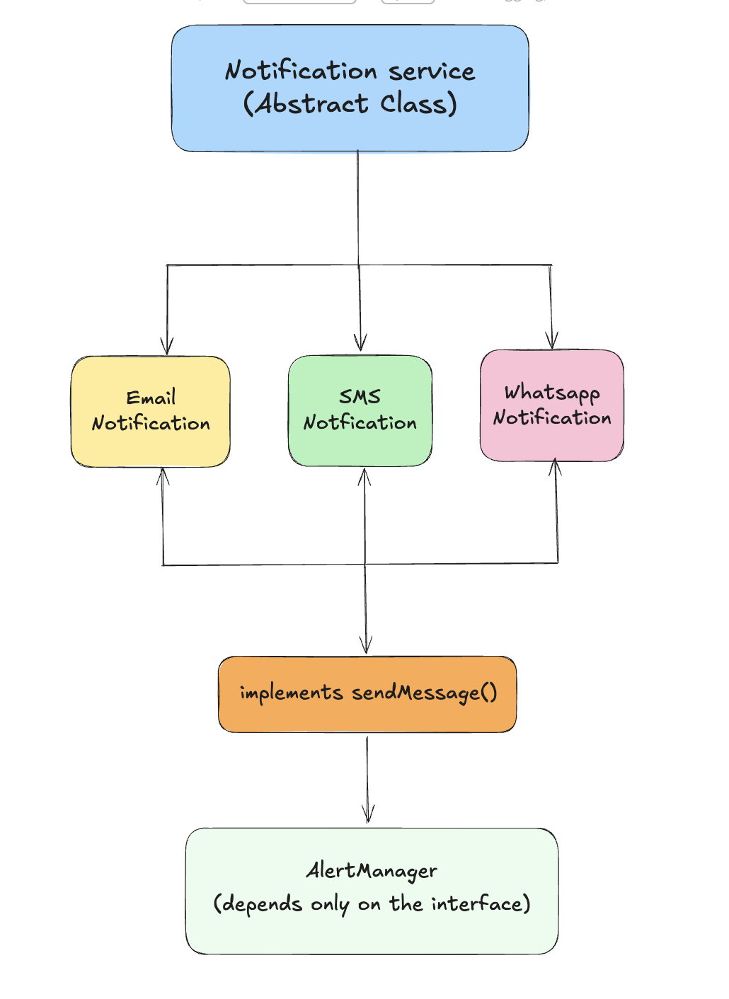

# OOPS

When I first started Learning OOPS , I always thought that it will be about just linked lists and trees and like all these 
examples which I am being taught in the tutoiral are only for one main purpose so that I can eventually understand every single
core concept around data structures.

But that is just 15% maybe  of what oops really, is in real life and in real world oops go beyond 
just trees linked list or explicitly declaring some class in a problem of priority queues 

It is a way to organize your code around real-world things. In a real 
project it may work with things like cars,vehicles, orders, products, notifications, 
carts, invoices, and many more.

Instead of keeping data in different variables and writing random functions everywhere, 
OOP allows you to keep related data and related actions together in one place which we often refer to as attributes and methods
of a class.

This makes your code easier to understand, easier to update, easier to test, 
and easier to maintain when your project becomes bigger. But to use OOP properly, 
you need to understand its core concepts. Because OOP is not only about creating objects.

It is about learning how to model real problems, manage complexity, reduce repeated code, 
and avoid turning your codebase into a messy system that breaks every time you change something.

I will be updating the file structure here properly but here in the first file we will go through building some of the very 
fundamental OOP core concepts which are required if you've master LLD. 

## 1. Classes: 

You can check out the implementation in the [Classes Code](classesss.cpp).

A simple very basic real life example is of a car in a code, we can create a car class with some basic attributes like color,speed,brand etc.
On top of that we can define some basic functions such as stop, accelerate, calculateSpeed etc as per what our useCases or business logic
we've to serve for.

But it is just a blueprint like when you go to buy a car you're been shown a catlog or you research about it online but all what
you see are images which are nothing but structures or images which cannot be experienced, yes obviously with the help of AI now you can 
do a lot of cool stuff! But in general you can't :) and hence you cannot live inside a blueprint and in order to experience you need to buy a car.

Similarly all the class in programming are simply blueprints and in order to use them for some real stuff like let's say placing 
an order for 2 butter naan and 1 plate butter chicken you"ll have to create an order instance(or object) for it in your codebase
You need to create some objects out of them so that you can actually look for it

### Access Modifiers: 
Access modifiers determine who can access members of a class:

public → Open to everyone; forms the class's external interface.

private → Hidden implementation details; accessible only within the class.

protected → Hidden from the outside world but available to derived classes, making it useful for inheritance.

| Modifier      | Same Class | Derived Class | Outside Class |
| ------------- | ---------- | ------------- | ------------- |
| **public**    | ✅          | ✅             | ✅           |
| **protected** | ✅          | ✅             | ❌           |
| **private**   | ✅          | ❌             | ❌           |

## 2. Objects

As explained above if your class is a blueprint then your object is nothing but just a real entity / instance
created from that blueprint. In simple words an object is a reusable copy of class For example, 
we created a Car class in the previous section. That Car class only defines what 
a car should have and what a car can do.

You can check out the implementation in the [Objects Code](objectss.cpp).

Here, car1, car2, and car3 are objects. All three objects are created from the same Car class. 
But each object has its own values.

Each object works independently.

If we increase the speed of car1, it will not change the speed of car2. 
If car2 starts, it does not mean car3 has also started.

They are separate objects created from the same class. 
This is one of the most important ideas in OOP. A class gives the structure. 
An object gives the real values.

Think about a house blueprint again. 
One blueprint can be used to build many houses. 
But after building them, each house can have a different color, different owner, 
different furniture, and different address. 
In the same way, one class can create many objects, and every object can have its own data.
Similar example can be taken for making a ticket booking system or a bank account opening system.

So, classes and objects together help us keep related data and behavior in one clean place. 
But in bigger applications, sometimes we do not only want to create objects. 
We also want to define a common set of actions that different classes must follow. 
That is where interfaces come in.

## 3. Interfaces

Now here comes a bit of twist a note before we start studying for interview purposes cpp doesn't have 
by default interfaces but but , Instead, interfaces are created using abstract classes with pure virtual functions. 
Because C++ natively supports multiple inheritance, a separate, dedicated "interface" type category is completely unnecessary

Now firstly understanding what interfaces are:

An interface is like a contract or a written agreement, It tells a class what methods it must have
,but **it does not explain how those methods should work**. In simple words, an interface says: “This class must provide these actions.”

Let's take a very simple example.

Imagine we are building a notification system. In an app, we may need to send notifications in different ways:

1. Email
2. SMS
3. WhatsApp
4. Push notification

All of them are different, but they have one common job:

They send a message. So instead of writing different logic everywhere, 
we can create one common interface called NotificationService.

You can check out the implementation in the [Interfaces Code](interfacess.cpp).

### Design of Notification Service: 

